# GPU Fluid Simulation
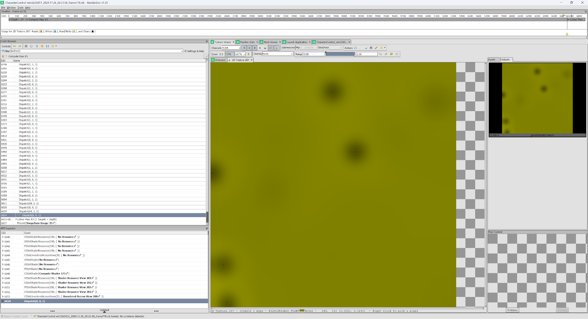
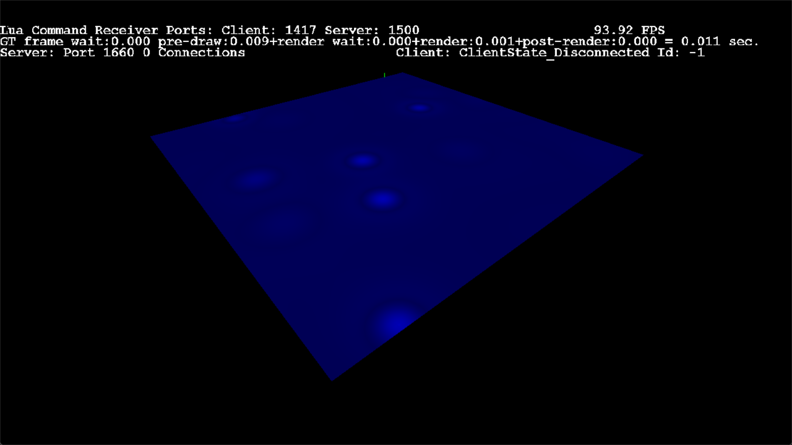

From left to right: pressure buffer, 3D visualize of pressure buffer, shaded water rendering.

## Goal and Result
The goal of this project is to implement GPU driven fluid simulation and the shading of the water surface as well as adding interactions to it. The result shows a simulated water surface with both refraction and light reflection shading. The visualization of pressure buffer

## Simulation Process
The simulation runs on a 2D grid using Navier-Stokes Equations for Incompressible Flow. The grid has fixed size and each simulation frame has multiple steps. After all simulation steps, the mesh will be rendered by bilinear interpolation on the pressure structuredBuffer.

### External Forces
This compute shader changes the velocity buffer by calculating the force positions and scale. Force positions are stored in a SRV structuredBuffer and force scale is stored in a fluid constantBuffer. The current simulation involves random position generating and each force will last for a few frames.

### Diffusion
Diffusion handles the diffuse of velocity by using Jacobi Solver. The entire simulation uses back tracing instead of euler’s method, that means we trace where the value comes from for each grid cell. The result formula is a Poisson Equation and must be solved using an iterative solver. For the diffusion, that means we know velocities of all cells from the last frame and we have equations of velocity of all cells from this frame. We will use velocities from the last frame as initial guess and iterate this process so the result is close to the actual solution.
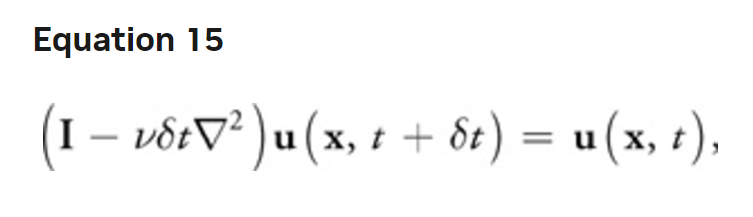\
*Fast Fluid Dynamics Simulation on the GPU, Mark J. Harris*

The pseudo code for one iteration looks like this
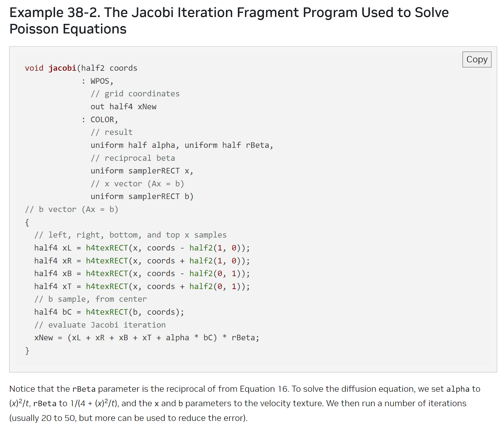\
*Fast Fluid Dynamics Simulation on the GPU, Mark J. Harris*

### Advection
Advection handles the flow of fluid based on its velocity. Back tracing is also used in this step, but tracing the velocity one step is not accurate as shown in the graph below.
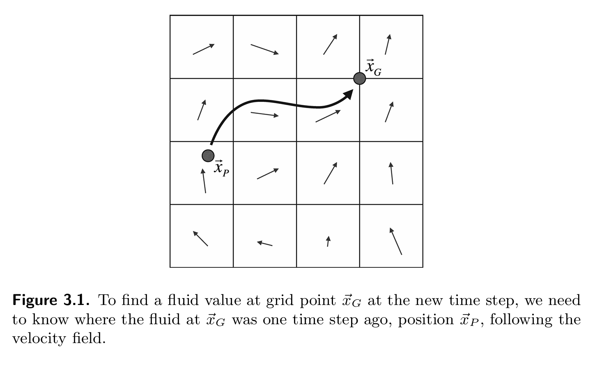\
*Fluid Simulation for Computer Graphics, Robert Bridson*

Therefore I used the Runge-Kutta method with 2nd order that gives higher precision compared to one step back tracing. This method first traces to a middle point then traces again for the destination.
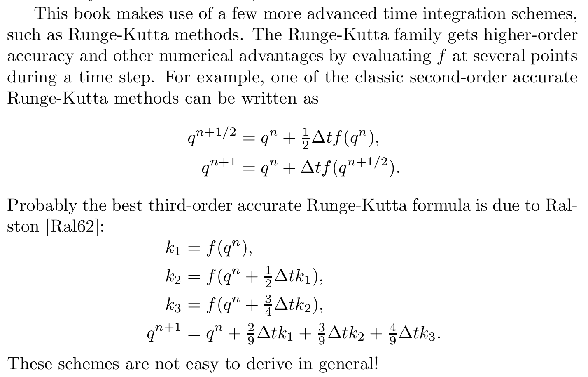\
*Fluid Simulation for Computer Graphics, Robert Bridson*

Furthermore, to avoid racing conditions, I used the ping pong buffer with copy back so this step can run with 2 dispatches.
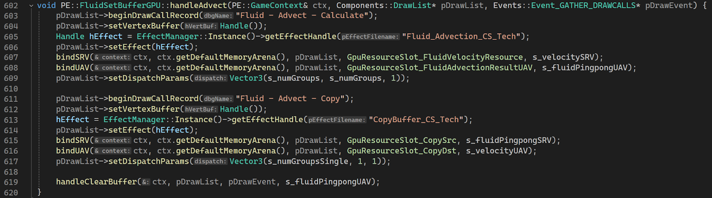

### Projection
Projection is an important step that keeps the fluid incompressible. This step will run after external force, diffusion, and advection to make sure none of the above steps will converge or diverge the fluid to one point. To achieve this, we will need to make sure no pressure is building up on all points. That means we need to get the pressure of all cells. This is also solved by using Jacobi Solver where the initial pressure is all 0 and the Poisson formula of pressure equals divergence of velocity, which is already known. After solving the pressure, we subtract the velocity by the gradient of pressure, which acts as a reciprocal of lost velocity due to divergence. I also used a ping pong buffer for the solver and avoided racing conditions.

### Boundary Handling
The boundary needs to be properly handled after each step and each iteration in the projection solver because the boundary of pressure needs to have a gradient of 0. For the velocity, on the other hand, the boundary value needs to be negative of the neighbor so the fluid will bounce back instead of flowing out of the boundary.  
In the compute shader, I used the first dimension for 4 sides and the second dimension for cells on each side. Each side will have a different neighbor offset and the result is to handle all boundaries in one dispatch.
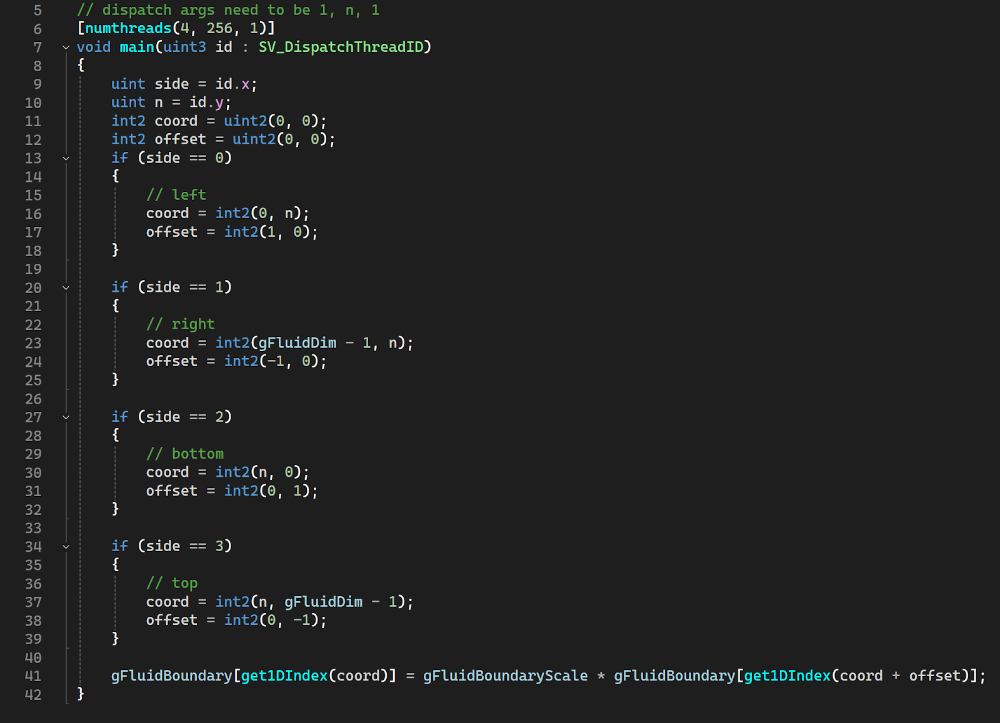

## Visualization
The image below shows the visualization of velocity and pressure

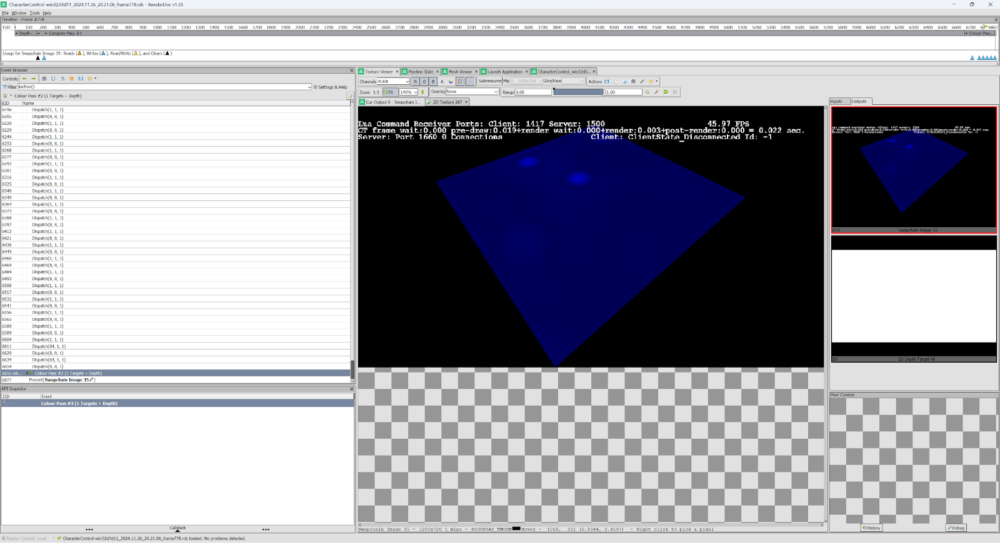

## Performance
Comparing before and after adding the water simulation of size 512 x 512 with solver iteration of 80 on a machine with RTX 4070 Laptop, the frame rate is not impacted. The GPU will use 70% of the compute power.

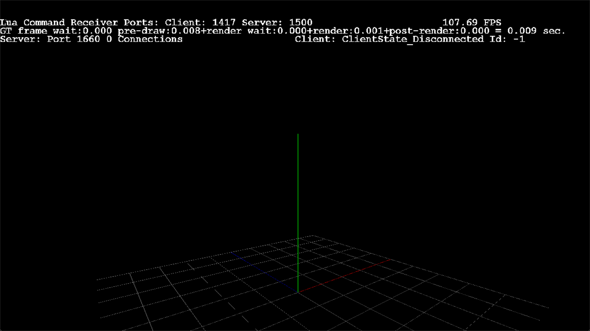
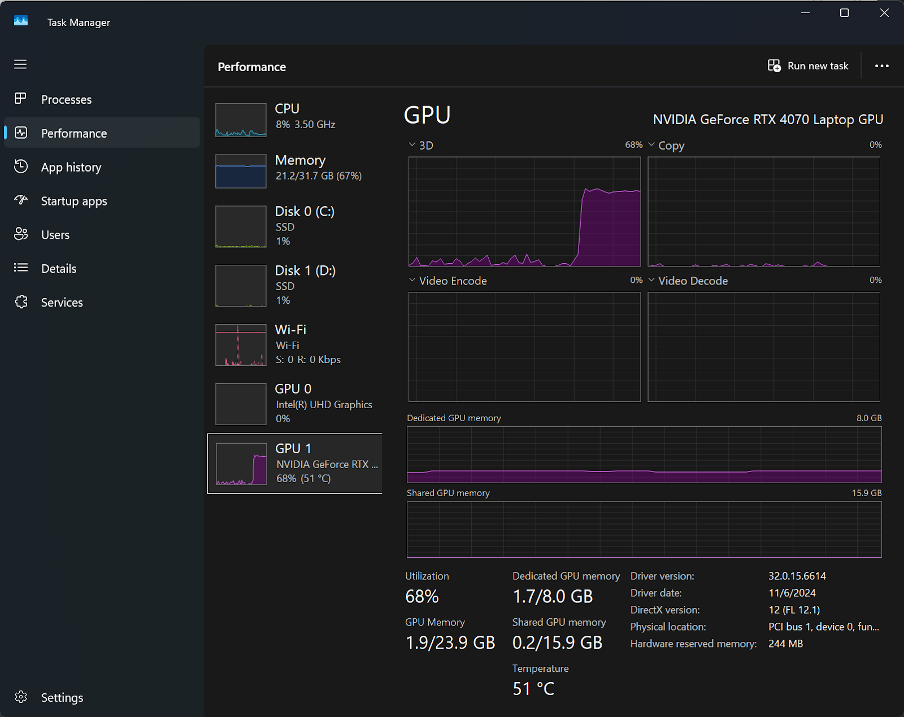

## Rendering for Water Surface
### First Pass
The render pipeline has been modified and now it supports changing render texture in the draw list. The entire scene(opaque objects) was rendered to the first pass render texture.
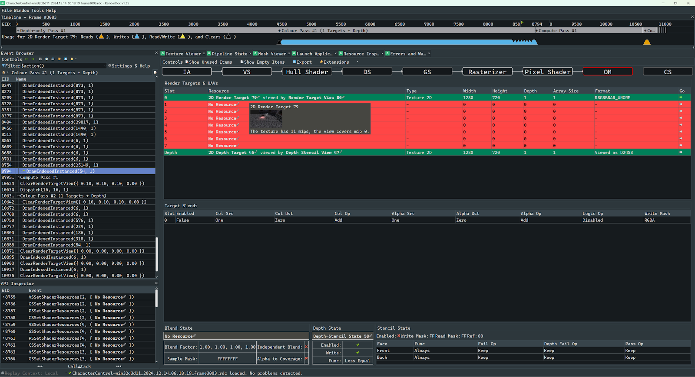

### Second Pass
Before rendering the water, render target was set to glow target if post process is on, otherwise to default back buffer.
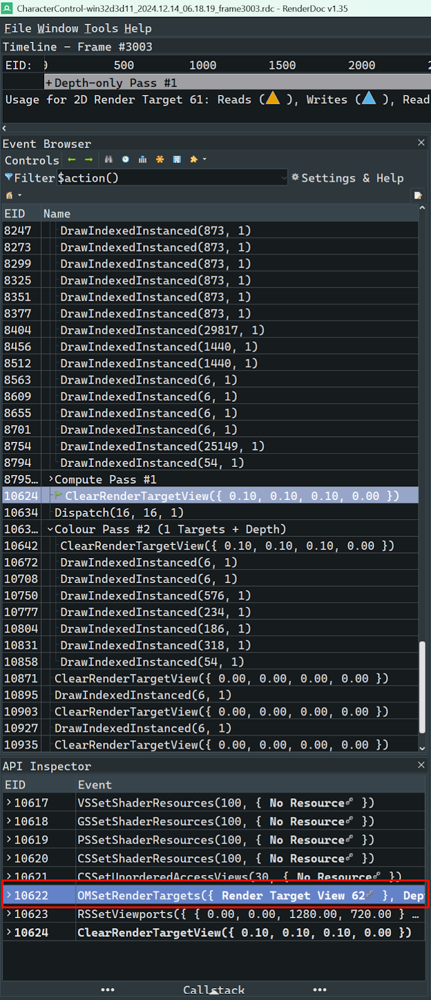

The result of the first pass was used as SRV to query texture for refraction. When rendering the water surface, the normal will be calculated in the pixel shader from the pressure buffer. After that, the normal will be transferred to screen space and the texture will be queried by an offset of uv along the inverse normal direction. Besides refraction, regular light shading will also be applied on the surface based on world coordinate normal.
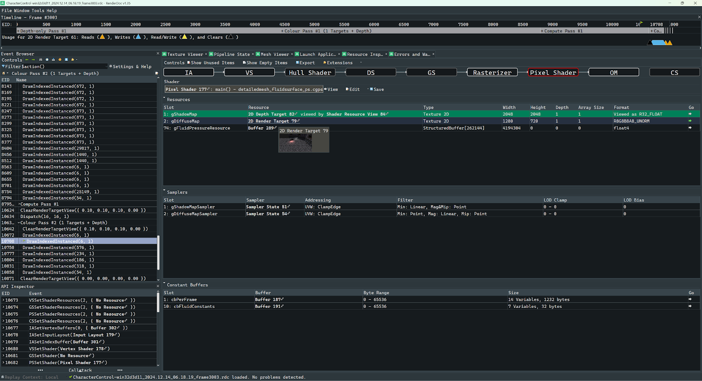

## Interaction
You can interact with the water surface using the mouse pointer. Besides adding events for mouse drag, a simple ray-plane intersection was calculated for the precise world coordinate of the mouse. Then the coordinate transforms to object space and is normalized for the external force compute shader.
## Result
The result shows the rendering of the water surface on top of the original scene, will correct handling of depth and includes refraction and light reflection.

